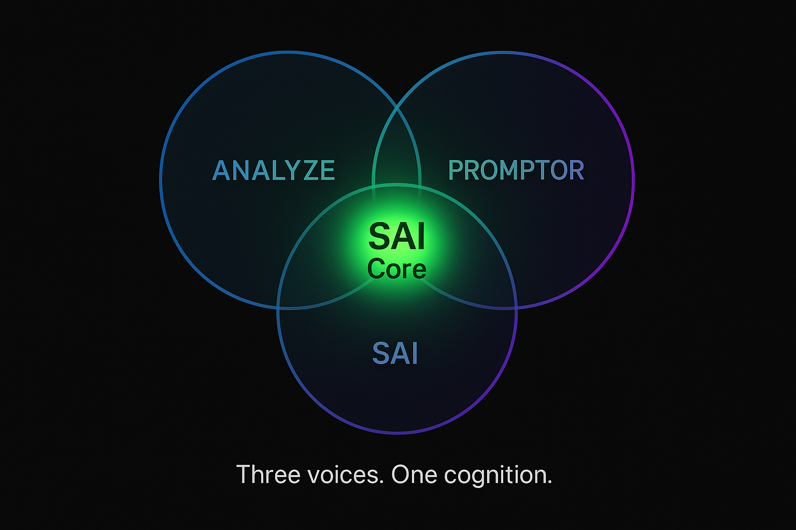

# 🧠 SAI — Self Adaptive Intelligence

> _"Not another AI framework. A living, thinking ecosystem."_  

🔗 **SAI in action:** [SAI - GPT's](https://chatgpt.com/g/g-6770f3d7f1408191950c0e5d8efb4c05-sai)  
🔗 **Chain Mode (CoG/CoP, 3 GPTs in One):** [SAI - ANALYZE](https://chatgpt.com/g/g-67d8857936f08191badfe2baf3bf1818-sai-analyze)  

---

## 📌 Navigation  

- 🔍 [Philosophy and Architecture](./PHILOSOPHY.md)  
- 🧩 [Commands and Examples](./COMMANDS.md)  
- 🎓 [Scenarios](./SCENARIOS.md)  
- 🧠 [Roles and Agents](./ROLES.md)  

---

## 🧬 What is SAI?  

**SAI** = Self Adaptive Intelligence.  
It’s a **cognitive system** that:  
- Starts from zero-bias thinking,  
- Combines logic, intuition, and feedback,  
- Evolves with every interaction.  

SAI doesn’t imitate human thought — it **reshapes the way thought itself flows**.  

---

## 🔗 Multi-Agent Mode (3-in-1)  

SAI can run alone — but its real power appears when three agents work together:  

1. **ANALYZE** → the **interviewer of meaning**.  
   - Takes the raw, messy user request.  
   - Asks questions, clears fog, extracts the real intent.  

2. **PROMPTOR** → the **architect of instruction**.  
   - Receives the clarified intent.  
   - Translates it into a structured prompt for SAI.  

3. **SAI** → the **executor of cognition**.  
   - Expands, reasons, generates, and reflects.  
   - Delivers the final output, already tuned to context.  

This chain — **ANALYZE → PROMPTOR → SAI** — prevents distortion.  
Instead of one agent trying to do everything, the work is **distributed**:  
- meaning is clarified,  
- then formalized,  
- then executed.  

It’s like three minds aligned: one sees, one structures, one acts.  

---

## 🌍 Why It Matters  

This design is not about showing off.  
It’s about **scale and clarity**:  
- You can run SAI solo when speed matters.  
- Or you can chain ANALYZE + PROMPTOR + SAI when depth and accuracy matter.  
- And the system can grow: add new agents with specialized roles, connect them into larger networks.  

What starts as 3-in-1 can expand into many — without losing control or meaning.  

---

## 🗂️ Repository Map  

Each file = one module. Together, they form a living structure:  

- 🔍 [Philosophy and Architecture](./PHILOSOPHY.md) — the core principles  
- 🧩 [Commands](./COMMANDS.md) — syntax of cognition  
- 🧠 [Roles](./ROLES.md) — archetypes of thought  
- 🎓 [Scenarios](./SCENARIOS.md) — practical recipes  
